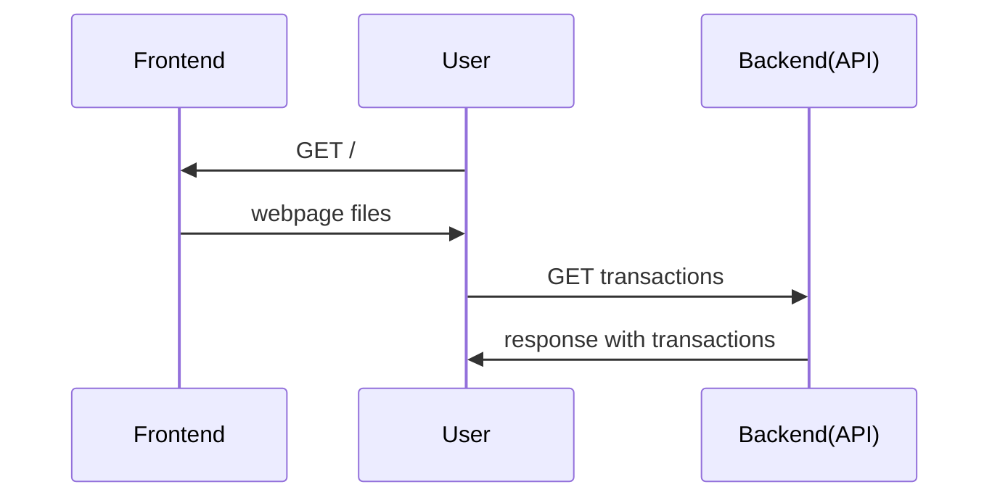

# Architecture

Basic user interaction with the system.

```mermaid
sequenceDiagram
    participant Frontend
    participant User
    participant Backend(API)

    User->>Frontend: GET /
    Frontend->>User: webpage files
    User->>Backend(API): GET transactions
    Backend(API) ->> User: response with transactions
```